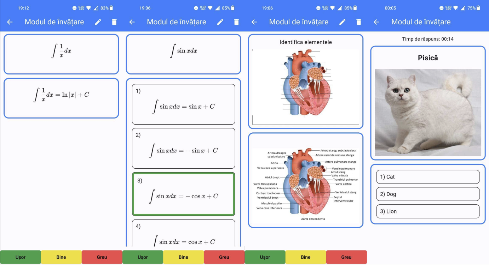
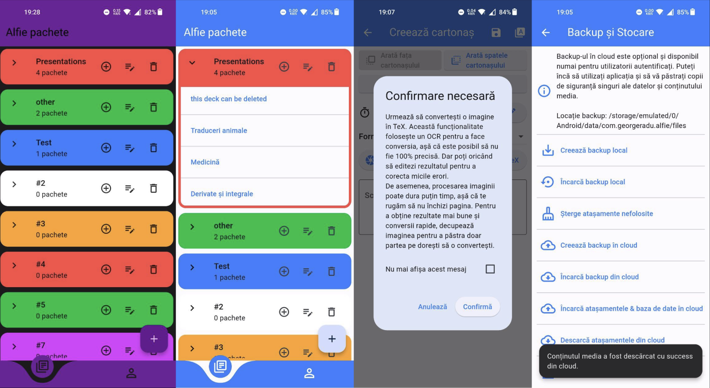
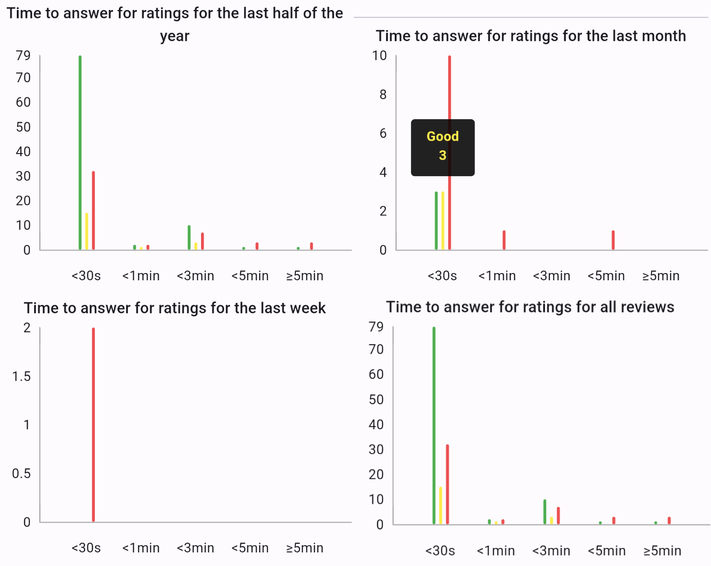
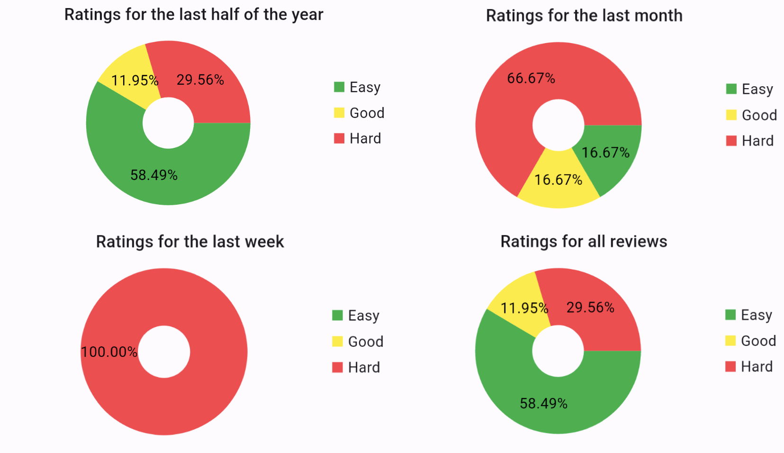
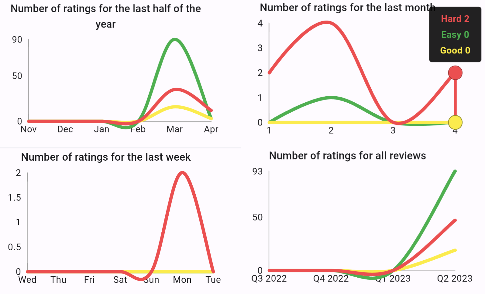

# Alfie client

Client in Flutter for the Alfie project.

## Cloud services

The cloud services is a separate repo. It can be found [here](https://github.com/george-radu-cs/alfie-cloud-services).

## Presentation images

### Examples of ui

<div>
    
    <br/>
    <br/>
    
    <br/>
    <br/>
    <div style="display:flex; flex-direction:row; align-items:start; justify-content:start;">
        
        
        
    </div>
</div>

### Examples of mail integrations


## Environment variables

```bash
cp .env.example .env
```

## Run in development mode

```bash
flutter run
```

## Generate the logo for the app

```bash
flutter pub run flutter_launcher_icons -f pubspec.yaml
```

## Generate the splash screen for the app

```bash
flutter pub run flutter_native_splash:create
```

## Rename the app

```bash
flutter pub global run rename --appname "Alfie" --target ios
flutter pub global run rename --appname "Alfie" --target android
```

## Production

Place the certificate for ssl comunication in the `assets/ca` directory and name it `alfie-cloud-services.crt`.

## For adding a new language

Multiple language definitions can be found in the `lib/l10n` directory.

## Create prod build

Signing

```bash
keytool -genkey -v -keystore ./android/upload-keystore.jks -keyalg RSA -keysize 2048 -validity 10000 -alias upload
```

Clean & build

```bash
flutter clean
flutter build appbundle
```

Install on device

```bash
bundletool build-apks --bundle=app-release.aab --output=app-release.apks
bundletool install-apks --apks=app-release.apks
```
